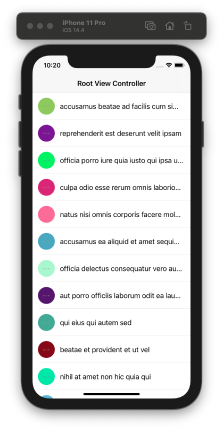
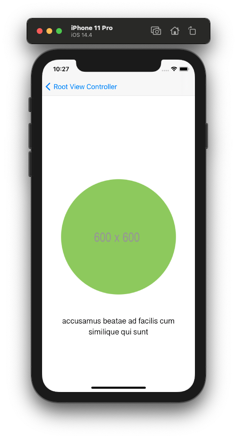

# SwiftNetworkLayer

### Easy network layer in Swift

### Requirements:

1. The app opens to homepage - a tableView. Each cell consists of a thumbnail image to the left and a
   title text on the right.

2. The app should download items to display from:
   
   https://jsonplaceholder.typicode.com/photos?_limit=20 

3. Pressing any of the cells should push a new ViewController containing full size image at the top and a
   title underneath.

4. The app should support paging, on scrolling to the bottom of a tableView, more elements should be
   loaded: https://jsonplaceholder.typicode.com/photos?_limit=20&_start=20

### Screens

|  |  |
| ---------------------------------- | ---------------------------------- |
